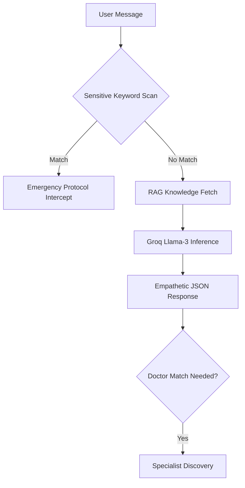
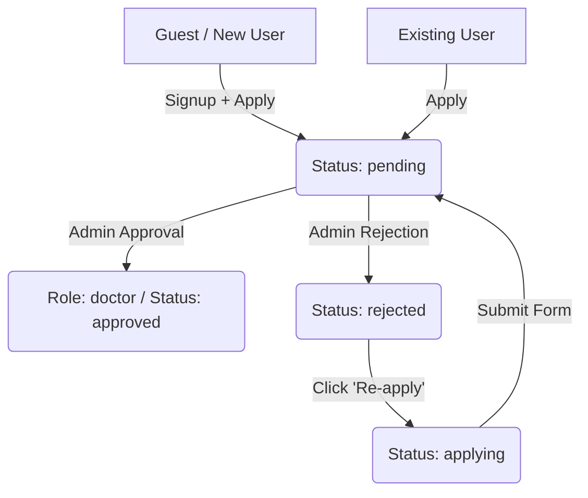
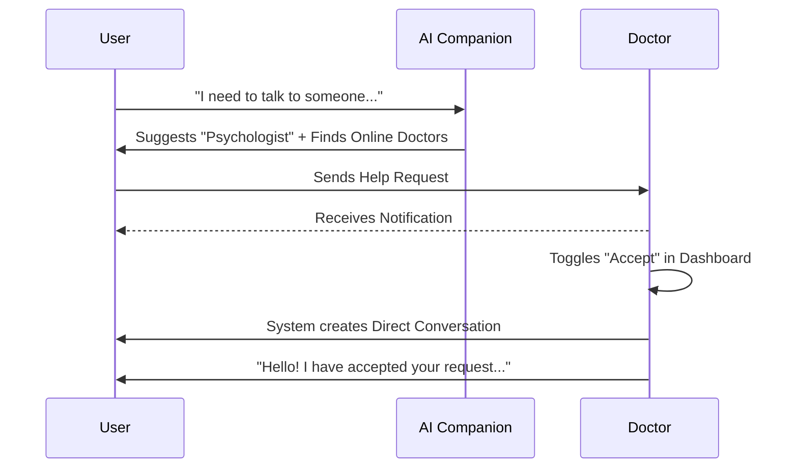

# AskDocPH: Mental Health & Professional Care Platform

## 1. System Philosophy
**AskDocPH** is built as a highly secure, empathetic mental health ecosystem. It follows a "Safety-First" architecture, where AI serves as a protective layer (filtering for self-harm and crisis) and a bridge to verified human professionals.

---

## 2. Core Technical Flows

### A. AI-Driven Care & Crisis Mitigation
The "Help Chat" is the entrance to the platform's care services.

*   **Technology**: Uses the `llama-3.3-70b-versatile` model via Groq for sub-second inference.
*   **Safety Layer**: A hard-coded whitelist of 30+ crisis keywords triggers a `crisisSupportMessage()` immediately, bypassing AI logic to ensure 100% reliable crisis intervention.
*   **Knowledge Bank**: Periodically fetches local `ai_knowledge.json` (Mental Health Database) to ground AI responses in factual, regional (Philippines) context.

### B. Biometric Onboarding & Governance
The doctor onboarding process uses "High-Fidelity Verification" to prevent impersonation.

*   **Workflow**:
    1.  **Identity Capture**: Users submit professional ID documents.
    2.  **Liveness Verification**: A video upload requirement for biometric analysis.
    3.  **Reference Indexing**: Base64 biometric payloads are hashed into a `biometric_reference_hash` for secure, non-reversible identity anchoring.
*   **State Management**: Users can transition from `none` -> `applying` -> `pending` -> `approved`. If `rejected`, users must explicitly "Re-apply" to clear their previous petition state.

### C. Real-Time Presence & Communication
The messenger system is optimized for reliability and user safety.

*   **Presence Tracking**: Middleware updates a user's `last_active_at` timestamp at most every 60 seconds. This drives the "Online Now" indicators for doctors.
*   **Messenger Architecture**:
    *   **Conversations**: Supports `direct` and `group` types.
    *   **Archivability**: Users can archive conversations to declutter their view.
    *   **Active Status**: Users can toggle their visibility and "Free to Talk" status.

---

## 3. User Capability & Lifecycle Flow

### Capability Matrix (Can vs. Can't)

| Status | social Feed / groups | messenger (Peer-to-Peer) | AI companion Chat | apply to Medical Panel | Handle Help Requests |
| :--- | :---: | :---: | :---: | :---: | :---: |
| **Guest** | 👁️ View Only | ❌ | ❌ | ✅ | ❌ |
| **User** (`none`) | ✅ | ✅ | ✅ | ✅ | ❌ |
| **User** (`applying`) | ✅ | ✅ | ✅ | ✅ | ❌ |
| **User** (`pending`) | ❌ | ❌ | ❌ | 🔄 (Waiting) | ❌ |
| **User** (`rejected`) | ✅ | ✅ | ✅ | ✅ (Via Petition) | ❌ |
| **Doctor** (`approved`) | ✅ | ✅ | ✅ | ❌ (Already Verified) | ✅ |

### The Onboarding Lifecycle

---

## 4. Consultation & Help Flow

How users move from seeking help to a doctor's care:

---

## 5. Database Architecture (Key Entities)

| Table | High-Level Purpose | Key Relations |
| :--- | :--- | :--- |
| **`users`** | Core identities, roles, and status. | `-> doctor_applications`, `-> posts` |
| **`doctor_applications`** | Verification data & biometric hashes. | `user_id`, `professional_titles` |
| **`doctor_requirements`** | Master list of mandatory documents. | System-wide config. |
| **`help_requests`** | Bridges users and doctors for consultation. | `user_id`, `doctor_id` |
| **`posts`** | Social content, mood hashtags, and media. | `user_id`, `group_id`, `resource_id` |
| **`conversations`** | Messaging containers for 2+ users. | `-> messages`, `-> participants` |
| **`daily_affirmations`** | Scheduled motivational content. | Admin-driven content. |

---

## 6. Security Hardening & Privacy

### A. Administrative Hardening
Admin sessions are protected by:
*   **Idle Timeout**: Forces logout after 15 minutes of inactivity.
*   **Hijack Protection**: Validates IP address and User-Agent on every request.

### B. Response Security (CSP)
Strict Content Security Policy (CSP) headers are injected to:
*   **Prevent Clickjacking**: `X-Frame-Options: SAMEORIGIN`.
*   **MIME Locking**: `X-Content-Type-Options: nosniff`.
*   **Origin Locking**: Restricting script/style execution to authorized CDNs and same-origin.

---

## 7. Administrative Oversight
Admins have granular control over:
*   **Analytics Dashboard**: Visualizes submission trends and specialist demographic splits.
*   **Content Management**: Defining the `ProfessionalTitle` master list.
*   **Application Triage**: Reviewing high-resolution proofs of ID and biometrics.

---

## 8. Developer Guidelines
*   **Environment**: Requires `GROQ_API_KEY` for AI features.
*   **Migrations**: Uses Laravel migrations for schema evolution.
*   **Throttling**: Login and signup endpoints are rate-limited.
